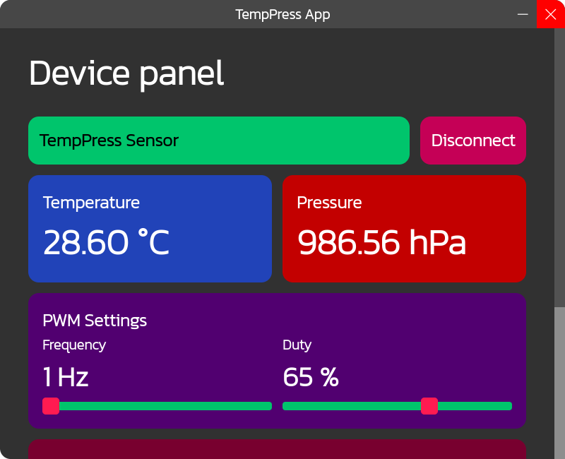
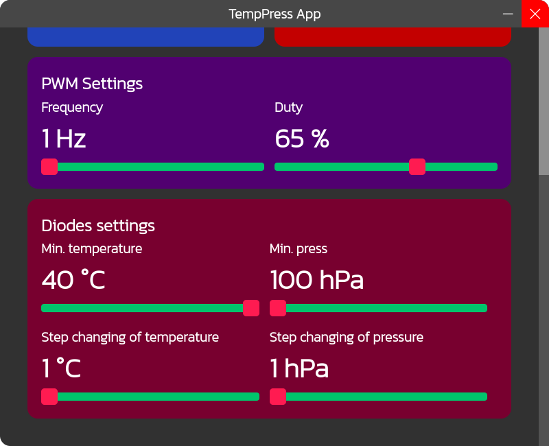
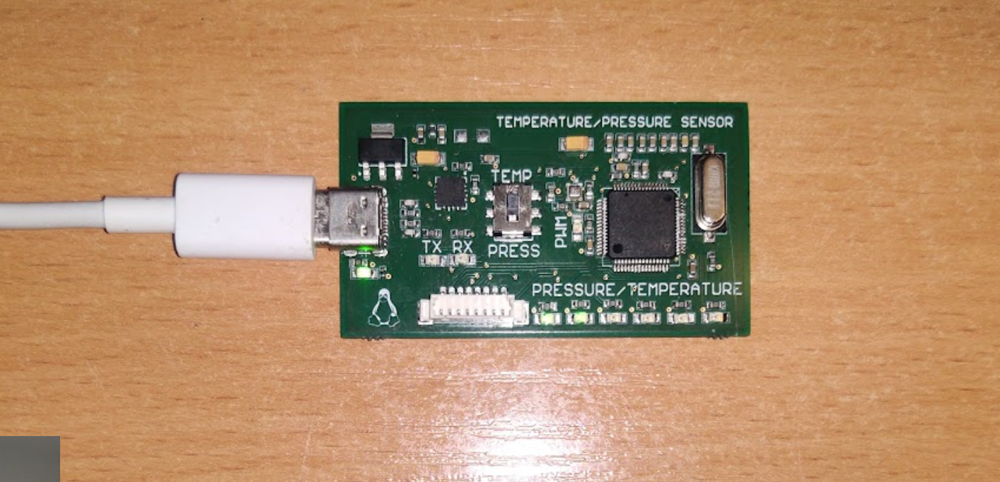

# TempPress
## Temperature and pressure device with PC app

A device which measures temperature and pressure. Also it has diodes which are scale for the choosen measurement. Also there is a PWM diode which the user can controll.

The device communicates to PC by the USB-C port and the USB-UART converter. The PCB uses STM32 MCU. Also there is a built-in MCU programmer.

The PCB was designed in Altium Designer.
The PC App was created in Visual Studio Code with Electron.
The MCU Source Code was created in STM32CubeIDE.

### PC App Images

### PCB Images

