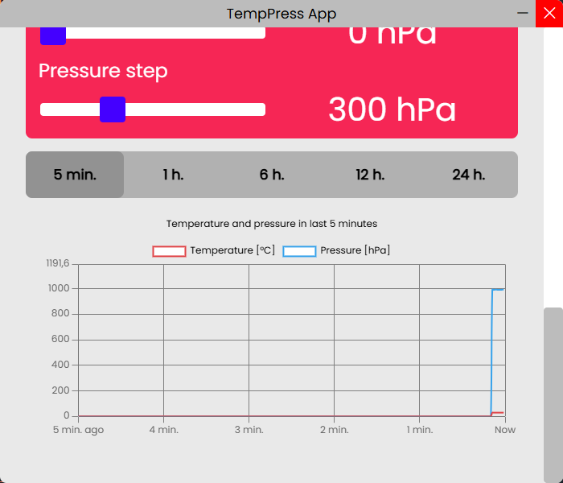

<table>
    <tr>
        <td width="200">
            
        </td>
        <td>
            <h1>TempPress</h1>
            <h3>Temperature and pressure device with PC app</h3>
            <h4>A device which measures temperature and pressure. Also it has diodes which are scale for the choosen measurement. Also there is a PWM diode which the user can controll.</h4>
            <h4>The device communicates to PC by the USB-C port and the USB-UART converter. The PCB uses STM32 MCU. Also there is a built-in MCU programmer.</h4>
            <br>
        </td>
    </tr>
</table>

### Features
* Changing themes
* Measurements of temperature and pressure with chart for the choosen time period
* PWM LED with possibility to changing its duty and frequency
* 6xLED Scale for temperature and pressure measurement
* A single switch to change 6xLED scale mode - temperature or pressure
* USB-C for communication with PC and power delivery

### Design

The PCB was designed in Altium Designer [LINK].
The PC App was created in Visual Studio Code with Electron [LINK].
The MCU Source Code was created in STM32CubeIDE [LINK].

### PC App

To run the app from source files we need type in the console:
```console
cd app
npm install
npm start
```

To build the app we need type in the console:
```console
cd app
```


## PC App Images

### Connecting panel


### Connecting modal


### Device panel




# Example raw communication with the device's PCB:

## PCB Images

