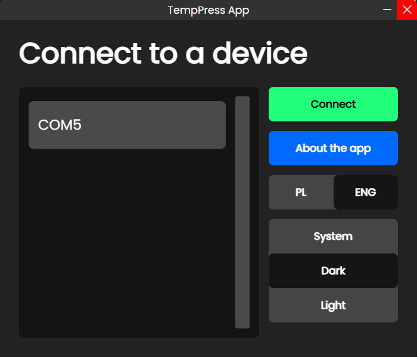
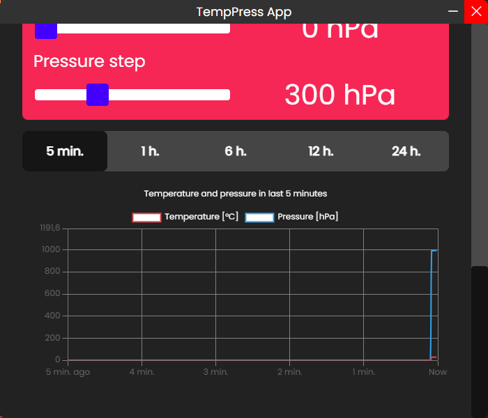
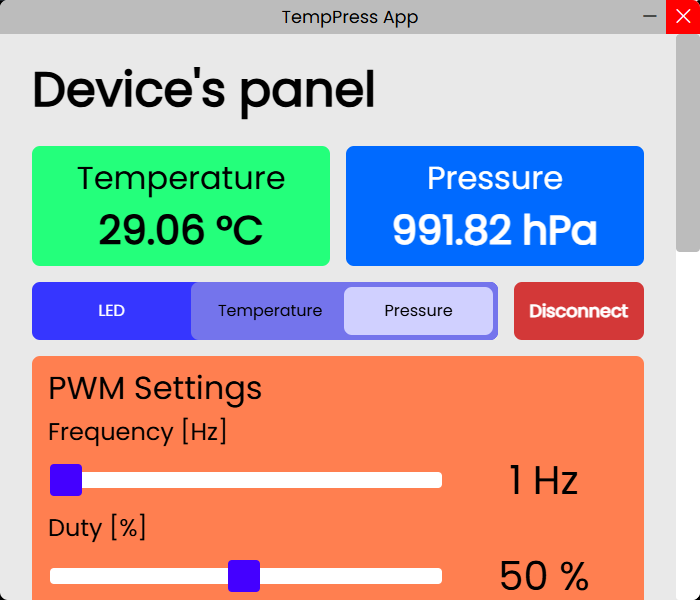

<table>
    <tr>
        <td width="200">
            
        </td>
        <td>
            <h1>TempPress</h1>
            <h3>Temperature and pressure Device with PC Application</h3>
            <h4>A device that measures temperature and pressure. It also has LEDs that act as a scale for the selected measurement, as well as a PWM-controlled LED which the user can adjust.</h4>
            <h4>The device communicates with a PC via a USB-C port and a USB-UART converter. The PCB uses an STM32 MCU. Additionally, there is a port for connecting an MCU programmer.</h4>
            <br>
        </td>
    </tr>
</table>

---

<h3>Status: finished</h3>

## Features
* Theme switching (light/dark mode)
* Temperature and pressure measurements with charts for the selected time period
* PWM LED with adjustable duty cycle and frequency
* 6x LED scale for temperature and pressure measurement
* A single switch to toggle the 6x LED scale between temperature and pressure modes
* USB-C for communication with the PC and power delivery

---

## Design

* The PCB was designed in **Altium Designer** [[LINK](./pcb)]
* The PC application was created in **Visual Studio Code with Electron** [[LINK](./app)]
* The MCU firmware was created in **STM32CubeIDE** [[LINK](./stm32/new_temp_press_project/)]

## PC Application

To run the application from source files, type in the console:
```console
cd app
npm install
npm start
```

To build the application (installers, portable zips etc.) from source files, type in the console:
```console
cd app
npm install
npm run make
```

## PC App Images

### Connecting panel




### Connecting modal


### Device panel







# Example Raw Communication with the Device's PCB

To establish a raw connection with the device, use a serial terminal with the following settings:
* **Baudrate**: 115200  
* **Data bits**: 8  
* **Parity**: None  
* **Stop bits**: 1  

Next, send a command:  
* if we want to get data: we need to type:
```console
{"cmd":1}
```
* if we want to change some device's settings: eg. if we want to change PWM settings we need to type:
```console
{"cmd":1, "pwmFreq": 2, "pwmDuty": 89}
```

If the command is correct, the device responses with actual measurements and settings.

## Example responses
```console
>> {"cmd": 1} #user
>> {"ledSwitch":1,"temp":29.01,"press":992.74, "pwmFreq": 1, "pwmDuty": 50, "tempMin": 0.00, "tempStep": 5.00, "pressMin": 0.00, "pressStep": 300.00} #device
>> {"cmd":2, "pwmFreq": 2, "pwmDuty":89} #user
>> {"ledSwitch":1,"temp":29.08,"press":992.81, "pwmFreq": 2, "pwmDuty": 89, "tempMin": 0.00, "tempStep": 5.00, "pressMin": 0.00, "pressStep": 300.00} #device
```

## PCB

